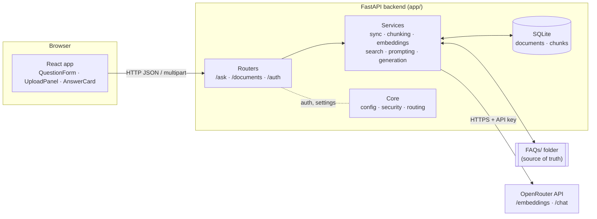
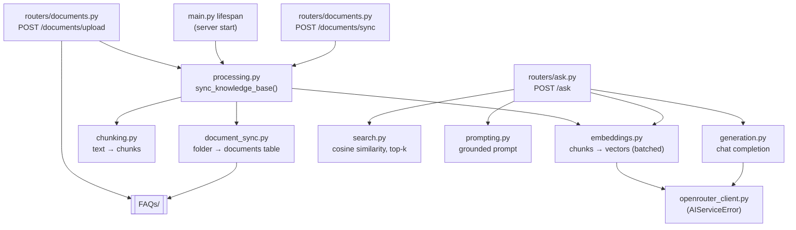
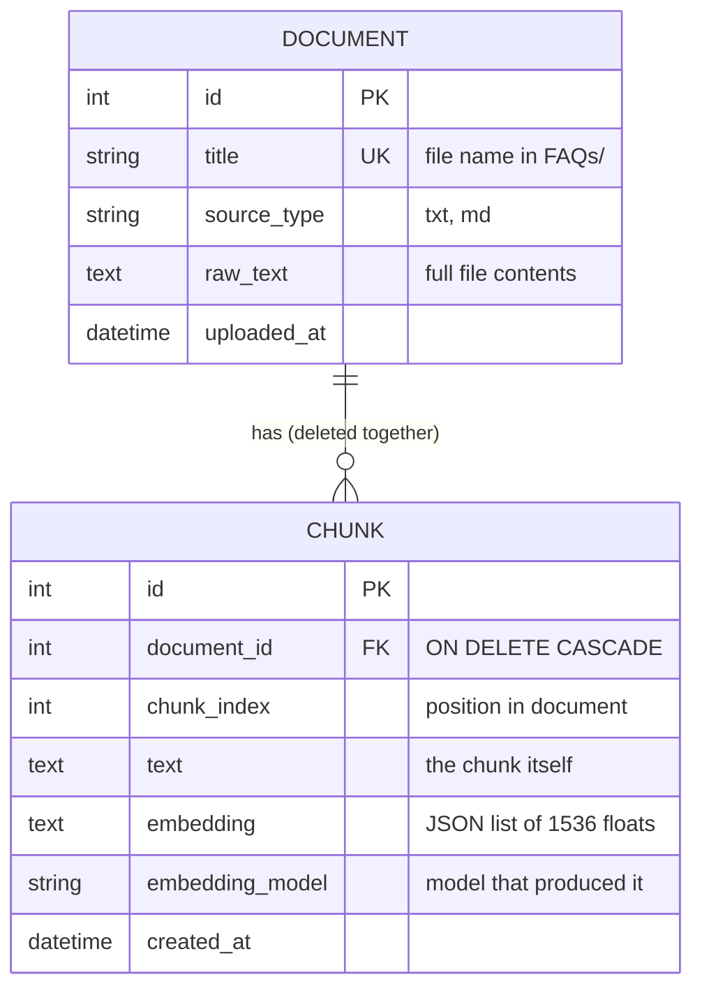
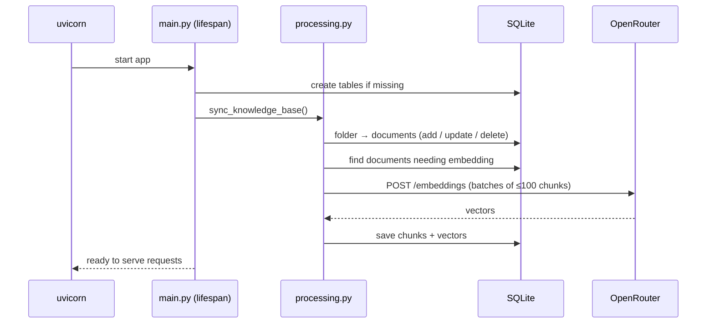
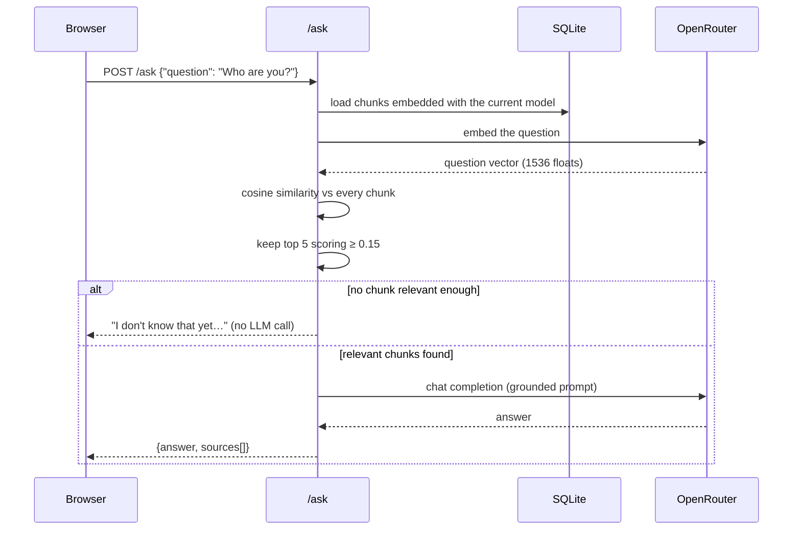

# Architecture

This document explains how Life Knowledge OS is put together, how its parts
connect, and how the RAG (retrieval-augmented generation) pipeline works,
including embeddings, retrieval, prompting and cost. Each design choice links
to official documentation or a trusted article, so you can check the
reasoning. The [Design decisions](#7-design-decisions-and-trade-offs) section
lists where this project deliberately departs from the usual production
approach, to be revisited later.

For setup and the API list, see the [README](../README.md).

---

## 1. Overview

Life Knowledge OS answers questions from your own notes, not from the model's
general knowledge. It has three parts:

| Part | Technology | Responsibility |
|---|---|---|
| **Frontend** | React 18 + TypeScript + Vite | Ask questions, upload documents, show answers with their sources |
| **Backend** | FastAPI + SQLAlchemy + SQLite | Sync documents, chunking, embeddings, retrieval, prompting, auth |
| **AI provider** | OpenRouter (HTTP API) | Embeddings (`openai/text-embedding-3-small`) and chat completions (`~openai/gpt-sol-latest`) |

The `FAQs/` folder is the **source of truth**. The SQLite database is derived
data, an index built from that folder. It can be deleted at any time and is
rebuilt on the next start.

---

## 2. System architecture



### Backend layers

The backend has four layers. Each one only calls the layer below it.

| Layer | Folder | What lives there |
|---|---|---|
| **HTTP** | `app/main.py`, `app/routers/` | App setup, startup (lifespan), CORS, error handler, endpoints |
| **Core** | `app/core/` | `config.py` (all settings from `.env`), `security.py` (JWT auth), `routing.py` (registers routers) |
| **Services** | `app/services/` | The RAG pipeline: plain functions, one job per module |
| **Data** | `app/database/`, `app/models/`, `app/schemas/` | Engine and session, ORM tables, request/response models |

### Service modules and how they connect



### Data model



- `(document_id, chunk_index)` is unique, so the same chunk can't be stored twice.
- `embedding_model` records which model produced each vector. Changing the
  model in `.env` makes the next sync re-embed everything, and `/ask` never
  compares vectors from different models.
- SQLite only enforces foreign keys when they're switched on, so the app turns
  them on for every connection
  ([SQLite docs](https://www.sqlite.org/foreignkeys.html)). The ORM cascade
  setup follows [SQLAlchemy cascades](https://docs.sqlalchemy.org/en/20/orm/cascades.html).

---

## 3. Request flows

### 3.1 Server start



This uses FastAPI's
[lifespan events](https://fastapi.tiangolo.com/advanced/events/), the
recommended replacement for `@app.on_event("startup")`. If OpenRouter is
unreachable, the error is logged and the server starts anyway, serving
whatever is already embedded.

### 3.2 Upload a document

1. The browser sends `POST /documents/upload` as `multipart/form-data`, the
   format FastAPI's
   [request files](https://fastapi.tiangolo.com/tutorial/request-files/)
   support requires.
2. The backend checks the file: `.txt`/`.md` only, at most 1 MB, UTF-8, not
   empty, a safe file name, and no existing file with the same name. These
   checks follow the
   [OWASP File Upload Cheat Sheet](https://cheatsheetseries.owasp.org/cheatsheets/File_Upload_Cheat_Sheet.html).
3. The file is saved into `FAQs/`, then the same `sync_knowledge_base()` runs.
   The new file is chunked and embedded exactly like a file added by hand.
4. If embedding fails, the file and its row are removed, and the API returns
   `503` so the upload can be retried.

### 3.3 Ask a question



`/ask` only *reads* the database. Syncing never happens during a question, so
answering is fast and two questions at once can't conflict.

---

## 4. How the RAG pipeline works

RAG means looking up relevant information first, then letting the language
model answer *from that information* instead of from memory. The idea comes
from Lewis et al.,
[*Retrieval-Augmented Generation for Knowledge-Intensive NLP Tasks*](https://arxiv.org/abs/2005.11401)
(NeurIPS 2020). For a plain-language explanation, see
[AWS: What is RAG?](https://aws.amazon.com/what-is/retrieval-augmented-generation/).
OpenRouter's own
[RAG with Embeddings & Rerank](https://openrouter.ai/docs/cookbook/evaluate-and-optimize/rag)
guide describes the same pipeline used here: index, retrieve with cosine
similarity, optionally rerank, generate.

The pipeline has two halves: **indexing**, which runs when documents change,
and **answering**, which runs for every question.

### 4.1 Documents (`document_sync.py`)

- Every readable UTF-8 text file in `FAQs/` becomes one `Document` row, keyed
  by its file name.
- If a file's contents change, its old chunks are deleted so they get rebuilt.
  If a file is deleted, its document and chunks are deleted too.
- Sync is triggered on server start, after an upload, and by
  `POST /documents/sync` (owner only). A lock stops two syncs from running at
  the same time.

### 4.2 Chunking (`chunking.py`)

Embedding a whole document as one vector would blur its topics together.
Chunks are small enough to match a question precisely, and large enough to
keep their context.

- **Size:** up to 1,000 characters (`CHUNK_SIZE`), which is about 250 tokens.
- **Where it splits:** between paragraphs first, then sentences, then words.
  It never splits mid-word. For the FAQ file, this means each chunk starts at
  a question.
- **Overlap:** each chunk starts with the last whole paragraphs or sentences
  of the previous one, up to 200 characters (`CHUNK_OVERLAP`). That way an
  idea that crosses a boundary isn't lost.
- **Result:** the FAQ file (9,450 characters) becomes 13 chunks of about 870
  characters each.

Pinecone's
[Chunking Strategies](https://www.pinecone.io/learn/chunking-strategies/)
recommends starting with fixed-size chunking and moving to structure-aware
(recursive or sentence) splitting when needed. This project uses the
structure-aware version from the start.

### 4.3 Embeddings (`embeddings.py`)

An **embedding** is a list of numbers that represents the *meaning* of a text.
Texts with similar meanings get vectors that point in similar directions, even
when they use different words: "Who are you?" ends up close to "Salman is a
software developer from Lahore". For an introduction, see
[Google ML Crash Course: Embeddings](https://developers.google.com/machine-learning/crash-course/embeddings).

- **Model:** `openai/text-embedding-3-small`, called through
  [OpenRouter's embeddings endpoint](https://openrouter.ai/docs/api/api-reference/embeddings/create-embeddings)
  (`POST /api/v1/embeddings`).
- **Output:** 1,536 numbers per text, the model's default size
  ([OpenAI embeddings guide](https://developers.openai.com/api/docs/guides/embeddings)).
- **Batching:** the endpoint accepts a list of inputs, so up to 100 chunks go
  in one request instead of one request per chunk.
- **Storage:** each vector is stored next to its chunk as a JSON string,
  together with the name of the model that made it.
- **Same model for both sides:** questions are embedded with the same model
  as the chunks. Vectors from different models can't be compared, so mixing
  them is prevented (see the data model above).

### 4.4 Retrieval (`search.py`)

- The question is embedded, then compared with every stored chunk using
  **cosine similarity**, which measures the angle between two vectors (1 means
  the same direction). OpenAI's guide recommends cosine similarity for its
  embeddings and notes they are normalised to length 1
  ([OpenAI embeddings guide](https://developers.openai.com/api/docs/guides/embeddings)).
- The **top 5** chunks (`TOP_K`) are kept, but only those scoring at least
  **0.15** (`MIN_SIMILARITY`).
- The threshold was measured on the FAQ file. Questions about the owner scored
  0.25–0.44, and unrelated questions ("capital of France", "quantum
  entanglement") scored 0.06–0.10. If nothing passes, the API returns a fixed
  "I don't know" answer and skips the LLM call, which saves cost and avoids a
  made-up answer.
- The search is a brute-force comparison in Python over every chunk. That's
  simple and exact, and fine for hundreds or a few thousand chunks (see
  [Design decisions](#7-design-decisions-and-trade-offs)).

### 4.5 Prompting (`prompting.py`)

The selected chunks and the question are placed in one prompt. The model is
told to:

- answer **only** from the given context
- say "I don't know" when the context doesn't cover the question
- speak in the first person as the owner, in a natural tone
- not mention "context" or file names, because the UI shows the sources itself
- reply in plain text with no Markdown, because the UI shows the text as-is

Limiting the model to the provided documents and allowing it to say "I don't
know" are both standard ways to reduce hallucinations. Anthropic's
[Reduce hallucinations](https://platform.claude.com/docs/en/test-and-evaluate/strengthen-guardrails/reduce-hallucinations)
guide recommends both.

### 4.6 Generation (`generation.py`)

- The prompt goes to `~openai/gpt-sol-latest` through the OpenRouter Python
  SDK, with at most 1,500 output tokens and a 60-second timeout.
- `~openai/gpt-sol-latest` is an alias that always points to the newest model
  in OpenAI's GPT Sol family
  ([model page](https://openrouter.ai/~openai/gpt-sol-latest)).
- An empty reply is treated as a failure.

### 4.7 Response

`/ask` returns:

```json
{
  "answer": "I'm Salman, a software developer based in Lahore…",
  "sources": [
    {"document_id": 1, "document_title": "faqs.txt", "chunk_id": 3,
     "chunk_index": 0, "snippet": "first 200 characters of the chunk…"}
  ]
}
```

The frontend shows the answer as a card and turns the unique
`document_title`s into source tags.

---

## 5. Cost

OpenRouter charges per **token**. A token is a piece of a word; in English, 1
token is about 4 characters
([OpenAI: What are tokens?](https://help.openai.com/en/articles/4936856-what-are-tokens-and-how-to-count-them)).

**Prices** (checked on OpenRouter at the time of writing; they can change):

| Model | Input | Output | Source |
|---|---|---|---|
| `openai/text-embedding-3-small` | $0.02 / 1M tokens | — | [OpenRouter pricing](https://openrouter.ai/openai/text-embedding-3-small/pricing) |
| `~openai/gpt-sol-latest` | $2.00 / 1M tokens | $10.00 / 1M tokens | [OpenRouter model page](https://openrouter.ai/~openai/gpt-sol-latest) |

**Estimates for this project**, based on the current FAQ file:

| Operation | Size | Cost |
|---|---|---|
| Embedding all notes (one full sync) | 13 chunks ≈ 11,400 characters ≈ 2,850 tokens | ≈ $0.00006 |
| Embedding one question | ≈ 10–20 tokens | ≈ $0.0000004 (negligible) |
| One answer: input | prompt ≈ 5,400 characters ≈ 1,350 tokens | ≈ $0.0027 |
| One answer: output | ≈ 150–250 tokens | ≈ $0.0015–0.0025 |
| **One question in total** | | **≈ $0.004–0.005**, about 200–250 questions per $1 |

What this means:

- Nearly all the cost is the **chat model**, not embeddings. Embedding 1
  million tokens of notes, roughly 4 MB of text, costs about $0.02.
- Questions with no relevant chunk cost almost nothing, because the LLM is
  never called.
- Unchanged documents are never re-embedded. Only new or changed files cost
  anything.
- The worst case per answer is capped by `CHAT_MAX_TOKENS=1500`, about
  $0.015 of output. Some newer models also bill internal "reasoning" tokens
  as output, which can make real costs somewhat higher than these estimates.
- `TOP_K` affects cost most directly: fewer chunks means a shorter prompt.

---

## 6. Security

| Area | How it works | Reference |
|---|---|---|
| **Auth model** | One owner account in `.env`: username, password hash, JWT secret. No users table, no sign-up. | — |
| **Login** | OAuth2 password flow: `POST /auth/token` returns a JWT bearer token. This is also what the **Authorize** button in `/docs` uses. | [FastAPI: OAuth2 with Password, Bearer with JWT](https://fastapi.tiangolo.com/tutorial/security/oauth2-jwt/) |
| **Password hashing** | Argon2 through `pwdlib`. A wrong username is checked against a dummy hash so it takes as long to reject as a wrong password, which hides whether the username exists. | Same FastAPI tutorial; [OWASP Password Storage](https://cheatsheetseries.owasp.org/cheatsheets/Password_Storage_Cheat_Sheet.html) recommends Argon2id |
| **What's protected** | Owner only: list documents, read a document, sync. Public: `/ask`, `/health`, `/documents/upload`. | — |
| **Uploads** | Allowed extensions only, size limit, safe file names, no overwriting. | [OWASP File Upload](https://cheatsheetseries.owasp.org/cheatsheets/File_Upload_Cheat_Sheet.html) |
| **AI errors** | Any provider failure becomes a generic `503`. Details go to the server log only. | — |
| **CORS** | Allows `localhost` and `127.0.0.1` on any port (`allow_origin_regex`). | [FastAPI: CORS](https://fastapi.tiangolo.com/tutorial/cors/) |
| **Secrets** | Kept in `.env`, which git ignores. The frontend only has `VITE_API_URL`, because every `VITE_` variable ends up in the browser. | [Vite: Env variables](https://vite.dev/guide/env-and-mode) |

---

## 7. Design decisions and trade-offs

Some choices here keep a single-user MVP simple and differ from the usual
production approach. Each one is listed below with what to change, and when.

| Area | Current choice | Usual production approach | When to change |
|---|---|---|---|
| **Vector storage** | Vectors stored as JSON text in SQLite; brute-force cosine similarity in Python | A vector index, e.g. [pgvector](https://github.com/pgvector/pgvector) (cosine distance, HNSW indexes) or a vector database | Once there are thousands of chunks or `/ask` gets slow (Phase 2 adds articles) |
| **Retrieval quality** | Embedding similarity only | Hybrid search (embeddings + BM25 keyword matching) plus reranking; see Anthropic's [Contextual Retrieval](https://www.anthropic.com/news/contextual-retrieval) and OpenRouter's [rerank guide](https://openrouter.ai/docs/cookbook/evaluate-and-optimize/rag) | When answers miss exact names, terms or numbers |
| **Chunk size unit** | Characters | Tokens, usually counted with a tokenizer | Only if chunks start hitting model limits; characters are a close enough proxy now |
| **Similarity threshold** | 0.15, measured by hand on one file | Tuned on an evaluation set of real questions | When more sources are added (Phase 2) |
| **Chat model** | `~openai/gpt-sol-latest`, an alias that moves to newer models | A pinned model version, so behaviour and price don't change unexpectedly | Before deploying publicly |
| **Upload access** | Public, with no login (an explicit choice) | OWASP recommends requiring authentication for uploads | Before deploying publicly; add login back or rate limiting |
| **Rate limiting** | None on `/ask` or upload | Per-IP limits on endpoints that cost money | Before deploying publicly |
| **Schema changes** | `create_all` plus deleting the database when the schema changes | Migrations with Alembic | When the database holds data that can't be rebuilt from files |
| **Evaluation** | Manual spot checks | A fixed set of questions with expected answers, run after every change | Before tuning retrieval |
| **Database path** | Relative (`./life_knowledge_os.db`), so it depends on where you start the server | Absolute path, or a server database | Known; postponed |

---

## 8. Further reading

**RAG**
- [Retrieval-Augmented Generation for Knowledge-Intensive NLP Tasks](https://arxiv.org/abs/2005.11401): the original RAG paper (Lewis et al., 2020)
- [AWS: What is RAG?](https://aws.amazon.com/what-is/retrieval-augmented-generation/): plain-language overview
- [OpenRouter: RAG with Embeddings & Rerank](https://openrouter.ai/docs/cookbook/evaluate-and-optimize/rag): the same pipeline, on the provider this project uses
- [Anthropic: Contextual Retrieval](https://www.anthropic.com/news/contextual-retrieval): how hybrid search and reranking reduce retrieval failures

**Embeddings and chunking**
- [Google ML Crash Course: Embeddings](https://developers.google.com/machine-learning/crash-course/embeddings): what embeddings are
- [OpenAI: Embeddings guide](https://developers.openai.com/api/docs/guides/embeddings): models, dimensions, cosine similarity
- [OpenRouter: Embeddings API](https://openrouter.ai/docs/api/api-reference/embeddings/create-embeddings): the endpoint used here
- [Pinecone: Chunking Strategies](https://www.pinecone.io/learn/chunking-strategies/): how to choose a chunking method

**Prompting and cost**
- [Anthropic: Reduce hallucinations](https://platform.claude.com/docs/en/test-and-evaluate/strengthen-guardrails/reduce-hallucinations): grounding and "I don't know"
- [OpenAI: What are tokens?](https://help.openai.com/en/articles/4936856-what-are-tokens-and-how-to-count-them): how tokens and cost relate

**Backend**
- [FastAPI: Lifespan events](https://fastapi.tiangolo.com/advanced/events/)
- [FastAPI: OAuth2 with Password, Bearer with JWT](https://fastapi.tiangolo.com/tutorial/security/oauth2-jwt/)
- [FastAPI: Request files](https://fastapi.tiangolo.com/tutorial/request-files/)
- [FastAPI: CORS](https://fastapi.tiangolo.com/tutorial/cors/)
- [SQLAlchemy: Cascades](https://docs.sqlalchemy.org/en/20/orm/cascades.html)
- [SQLite: Foreign key support](https://www.sqlite.org/foreignkeys.html)
- [pgvector](https://github.com/pgvector/pgvector): the likely next step for vector search

**Security**
- [OWASP: Password Storage Cheat Sheet](https://cheatsheetseries.owasp.org/cheatsheets/Password_Storage_Cheat_Sheet.html)
- [OWASP: File Upload Cheat Sheet](https://cheatsheetseries.owasp.org/cheatsheets/File_Upload_Cheat_Sheet.html)
- [Vite: Env variables and modes](https://vite.dev/guide/env-and-mode)
